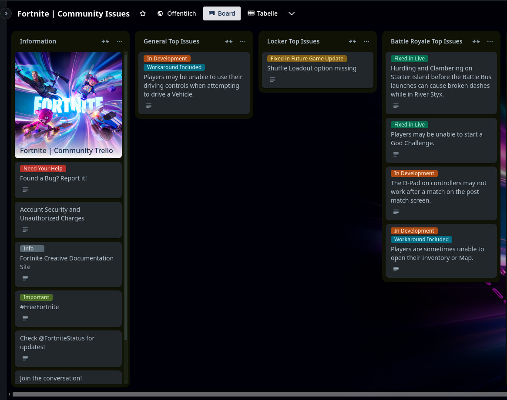
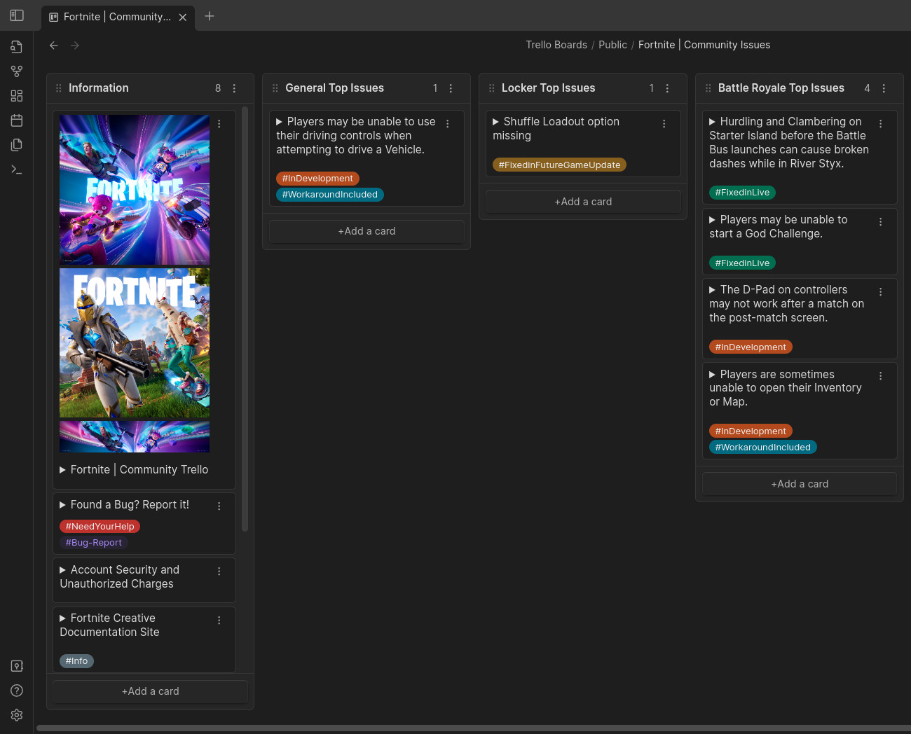

# Trello Exporter

This project is a command-line tool for exporting Trello boards including all attachments and generating Obsidian Kanban boards from the exported data.

## Table of Contents
- [Information](#information)
- [Installation](#installation)
- [Usage](#usage)
- [Examples](#examples)
- [Notes](#notes)


## Information
| Board on Trello.com | Board exported in Obsidian - Kanban |
| :---: | :---: |
|  |  |

## Installation
1. Clone the repository to your local machine:
   ```
   git clone https://github.com/MajortomVR/Trello-export-to-Obsidian-Kanban.git
   ```

## Usage
1. Obtain your Trello API key and token from the Trello Developer website.
2. Run the tool with the following command, providing your API key and token:
    ```
    python export_trello_board.py <api_key> <api_token> [board_id]
    ```
    - Replace <api_key> and <api_token> with your Trello API key and token, respectively.
    - Optionally, specify a Trello board ID (or URL) to export a specific board. If omitted, the tool will list all available boards.
3. There will be a ```[BOARDNAME].md``` file in ```boards/[BOARD_ID]/```
4. Copy that markdown-file and the folder ```attachments``` somewhere into your Obsidian Vault.
5. Profit: You can now use your board in Obsididan


## Examples
List all available Trello boards:
```
python export_trello_board.py <api_key> <api_token>
```

Export a specific Trello board:
```
python export_trello_board.py <api_key> <api_token> <board_id>
```


## Notes
Output structure:
```
Export structure
├── boards
│   ├── [Board_ID]
│   │   ├── attachments
│   │   │   └── [media files]
│   │   ├── checklists
│   │   │   └── checklists_cardid.json
│   │   ├── board.json
│   │   ├── lists.json
│   │   ├── cards.json
│   │   └── labels.json
```